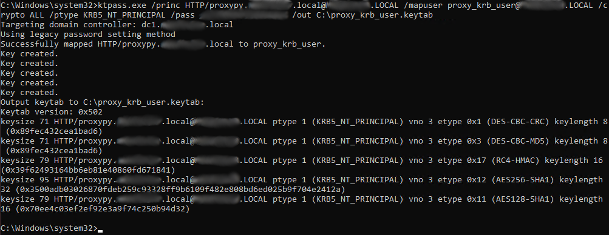
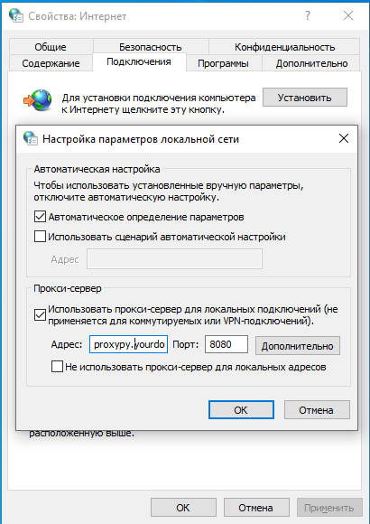

# Kerberos auth plugin

Kerberos auth plugin for [proxy.py](https://github.com/abhinavsingh/proxy.py/tree/develop). This is minimal example. [kerberos](https://github.com/apple/ccs-pykerberos) library is used.

## Example data

> **Username:** proxy_krb_user
>
> **Domain:** YOURDOMAIN.LOCAL
>
> **Proxy server host:** proxypy.yourdomain.local
>
> **Proxy server port:** 8080
>
> **Keytab file location:** /home/user/proxy_krb_user.keytab

## Run the example

1. Create keytab file. Execute on the domain controller:

    ```cmd
    ktpass.exe /princ HTTP/proxypy.yourdomain.local@YOURDOMAIN.LOCAL /mapuser proxy_krb_user@YOURDOMAIN.LOCAL /crypto ALL /ptype KRB5_NT_PRINCIPAL /pass p@ssword /out C:\proxy_krb_user.keytab
    ```

    

2. Copy keytab file to roxy server (`/home/user/proxy_krb_user.keytab`)/

3. Install necessary packages (example for debian/ubuntu):

    ```bash
    sudo apt install gcc python3-dev python3-venv libkrb5-dev krb5-user
    ```

4. Create end enter virtual environment (optional):

    ```bash
    python3 -m venv venv

    source venv/bin/activate
    ```

5. Install python requirements:

    ```bash
    pip install -r requirements.txt
    ```

5. Run the example:

    ```bash
    export KRB5_KTNAME=/home/user/proxy_krb_user.keytab
    python main.py --port=8080 --hostname=0.0.0.0 --krb-hostname=proxypy.yourdomain.local
    ```

6. Configure clients to use proxy server.

    ```cmd
    inetcpl.cpl
    ```

    Internet options → Connections → LAN Settings

    


If everything works you will see usernames instead of IPs in the access log:

```
2023-11-01 15:04:25,192 - pid:141260 [I] server.access_log:384 - 10.10.12.13:61724 - CONNECT None:None - 0 bytes - 1.11ms
2023-11-01 15:04:25,095 - pid:141260 [I] server.access_log:384 - testuser@YOURDOMAIN.LOCAL:61722 - CONNECT avatars.githubusercontent.com:443 - 453 bytes - 107.96ms
2023-11-01 15:04:25,372 - pid:141261 [I] server.access_log:384 - testuser@YOURDOMAIN.LOCAL:61726 - CONNECT github.githubassets.com:443 - 4266 bytes - 161.16ms
```

# Notes

* Domain case in the ktpass command is important (yourdomain.local is not same as YOURDOMAIN.LOCAL).

* Clients must use proxy server hostname instead of IP address. Otherwise kerberos authentication will not work.
